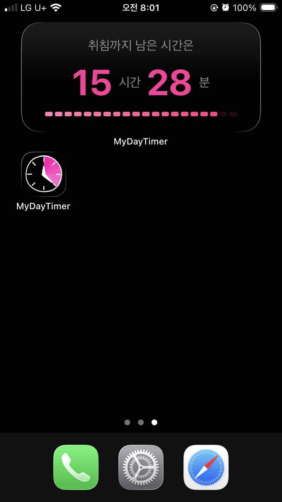
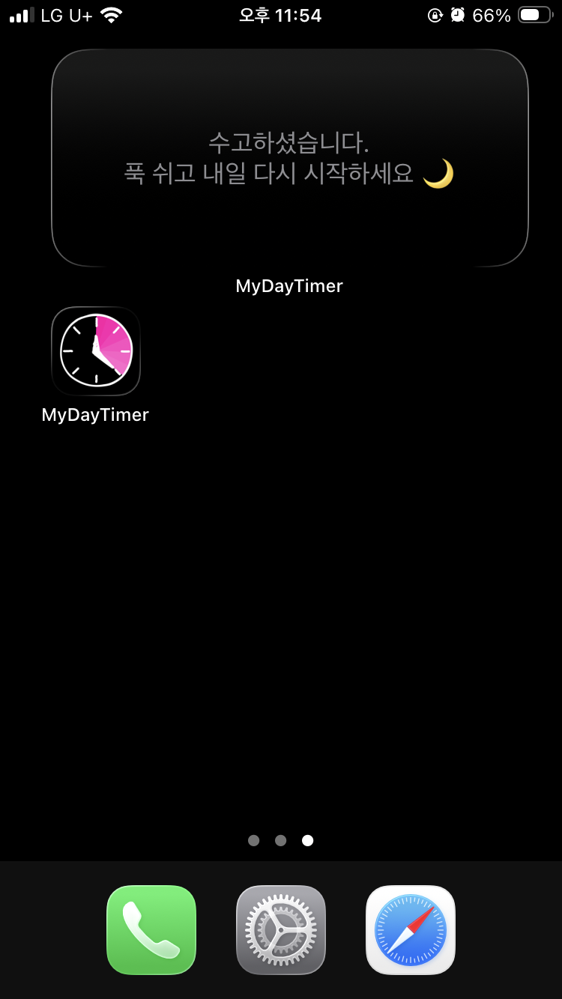
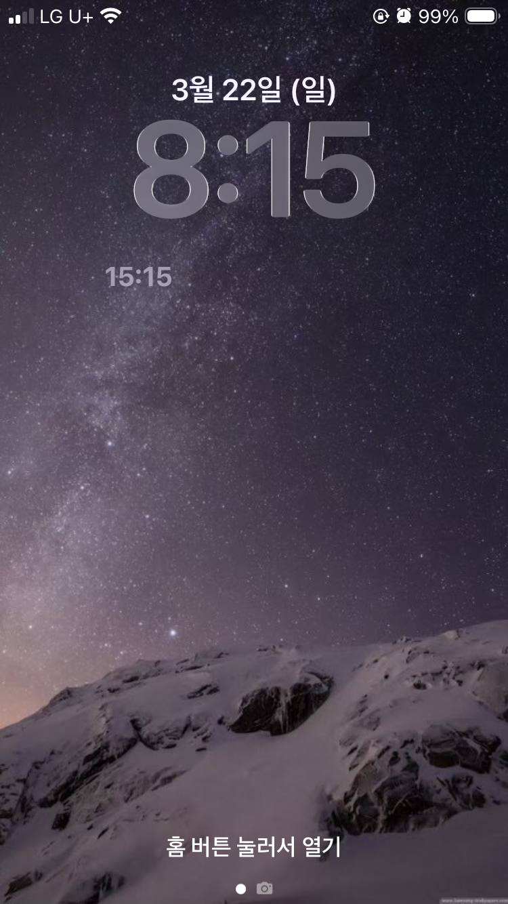
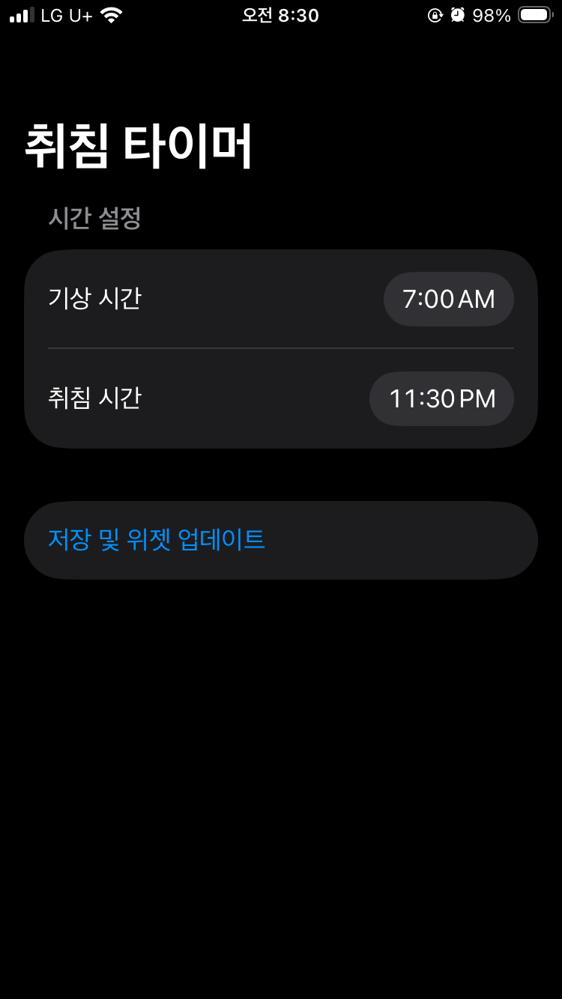

# ⏳ MyDayTimer 

이 앱은 시간을 기록하는 앱이 아닙니다.   
👉 내가 오늘 하루 쓸 수 있는 시간이 얼마나 남았는지 눈으로 확인해서 "밀도 있는 하루"를 보낼 수 있도록 도와주는 앱입니다.  

---
## ✨ 주요 기능

- ⏰ 기상 시간 / 취침 시간 설정
- ⏳ 취침까지 남은 시간 실시간 표시
- 📊 남은 시간 프로그레스 바 시각화
- 📱 홈 화면 & 잠금화면 위젯 지원
- 🎨 미니멀 UI
---

## 💡 만든 이유

하루가 길다고 착각하면서 시간을 낭비하는 경우가 많았습니다.

기존 타이머 앱은:
- 매번 직접 실행해야 하고
- 터치 한 번으로 멈춰버리고

그래서 생각했습니다.

👉 “내가 실제로 쓸 수 있는 시간을 항상 보여주는 앱이 있으면 어떨까?”

그렇게 이 앱을 만들게 되었습니다.

---

## 📸 Screenshots

<table>
  <tr>
    <td align="center">
      
       
      홈 화면 위젯
    </td>
    <td align="center">
      
       
      집중 시간 종료 위젯
    </td>
  </tr>
    <tr>
    <td align="center">
      
       
      잠금 화면 위젯
    </td>
    <td align="center">
      
       
      앱 실행 화면
    </td>
  </tr>
</table>

---

## 🛠 기술 스택

- Swift
- SwiftUI
- WidgetKit

> 빠르게 아이디어를 구현하는 데 집중한 "바이브 코딩" 방식으로 개발했습니다.

---

## 📌 실행 방법
### 요구 사항
- macOS
- Xcode 15 이상
- iOS 18 이상
- Apple Developer 계정 (실기기 실행 시 필요)

### 1. 레포지토리 클론  

### 2. Xcode에서 프로젝트 실행
`open MyDayTimer.xcodeproj`
### 3. 서명(Signing) 설정
Xcode에서 프로젝트 선택  
App 타겟 → Signing & Capabilities  
Team을 본인의 Apple ID로 설정  
동일하게 Widget Extension 타겟도 설정   
### 4. App Group 설정 (필수)

앱과 위젯이 데이터를 공유하기 위해 반드시 설정해야 합니다.

App 타겟 / Widget Extension 타겟 각각에서  
Signing & Capabilities → App Groups 추가  
아래 그룹 추가 후 체크 (코드에 아래 내용을 수정해서 본인이 원하는 그룹으로 수정할 수 있습니다.)  
`group.com.temp.daytimer` 
### 5. 앱 실행
iPhone을 Mac에 연결  
Xcode 상단에서 연결된 iPhone 선택  
▶ 버튼으로 실행 
### 6. 위젯 추가
홈 화면에서 길게 누르기 
상단 "+" 버튼 클릭 
"MyDayTimer" 검색 
위젯 추가

---
